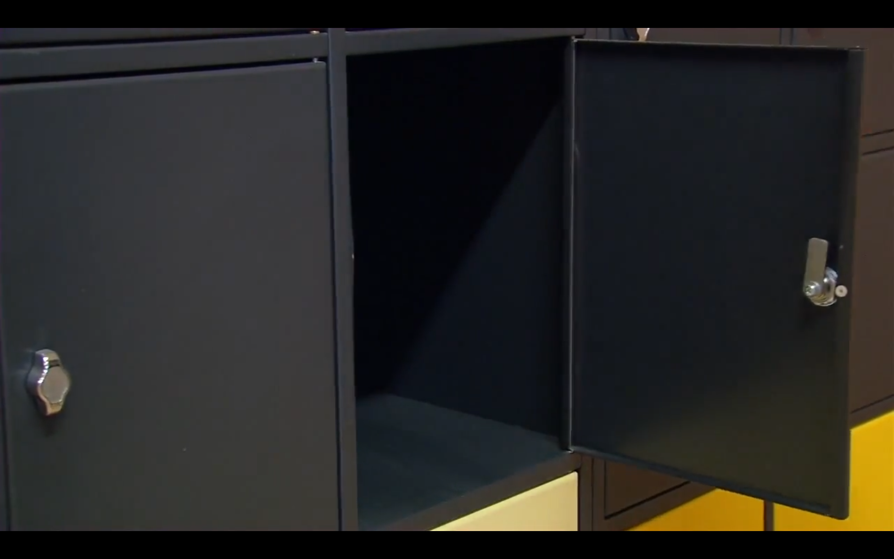
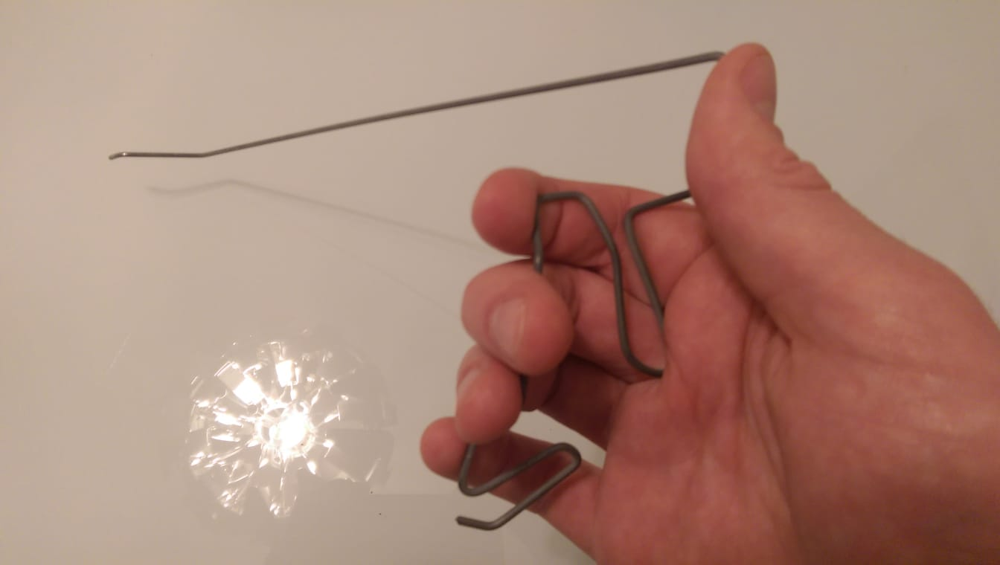
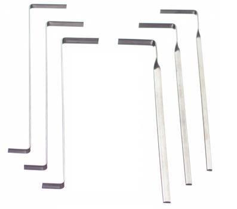
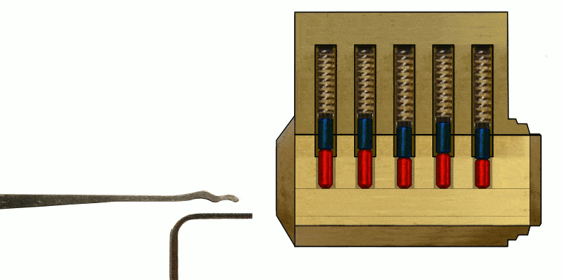

# this talk won't help you steal

## (but it may be fun)

^
So hi! I’m Wen, and I’m here to tell you about lock picking! Now, I’ve given this talk before – which is good! I’m experiences – but it’s also been almost a year, so I’m kinda unprepared. Let’s see if my slides are good enough to guide me through this, okay?

---

# [fit] my first lock

^
I picked my first lock in high school. It was a collaborative effort. Owning a lock picking kit is illegal in the Netherlands, so I had to get a bit creative.

---

^
See, one day the school told us that’d they were gonna replace all the old school lockers with, like, keys and whatnot, with these awesome Noki locks. They work a little bit like this.

---

^
If you look inside one of them… on the one side, there’s a bar which can move. If it’s horizontal, it blocks the door. On the other side, there’s a tiny metal triangle. It’s sloped at the top, so if you push the bar down, you push it out of the way, and the bar goes down. However, it’s flat at the bottom, so the bar can’t come back up! When you use your card, a tiny magnet pulls that triangle out of the way, and your locker can open.

---

^
So my friend and I, we snuck into the engineering classroom, and made this thing. Don’t mind the part on the right, that’s just the handle.

---

^
The bit at the bottom is what matters. You see, you can slide this over the top of the door, and then use it to push that little triangle out of the way… freeing that bar, and opening the locker! It takes a bit of effort, but honestly, it’s pretty easy.

---

# [fit] <insert triumphant photo here>

^
Woohoo! We could open *any* locker now!

---

^
Of course, at the same time, two friends of ours figured out that the card is an RFID chip… there’s a single number on there. Your **locker number**, in plain text.

---

# 🤷🏻‍♀️

^
So points for security all-round.

---

# why won't this help me steal?

^
So anyway, the title of this talk mentions that it won’t help you steal. But why not? Well, lock picking is a skill, and it can takes tonnes of time to open a lock, as you’ll find…

^
On the other hand… I found this video on YouTube. It’s from a dorm room in Texas. The bathroom lock broke, and this person called maintenance, who showed up with a crowbar.

---

<!-- https://www.youtube.com/watch?v=TFqTh8NTIqY -->
<!-- Student Housing Center in Bryan, Texas      -->

^
Let’s count together…

^
It takes you about 10 seconds to open most doors with a crowbar.

---

<!-- https://www.youtube.com/watch?v=FqhhXyROxQM -->

^
And then some European locks are vulnerable to this thing called “lock snapping” where you, uh, literally break the lock in half.

---

<!-- https://www.youtube.com/watch?v=rDlZbQ20aLI -->

^
And then you’ve got this sort of shit. This person has fitted a “bump key” onto an electric toothbrush… for some reason.

^
You’ll learn why this works later.

---

^
And this one is new, I’ve added it since the last time I gave this talk.

^
Maybe not the most stealthy way, but it looks… “fun”.

---

# so how does it work?

^
Ok! I promised I’d teach you how to pick locks, so let’s do that!

^
Now, there’s many different kinds of locks, and we’ll go over a couple of them.

---

# tumbler locks

^
First and foremost, there’s tumbler locks. They’re the most common type of lock *by far*.

---

^
Tumbler locks look like this… if you managed to cut one precisely in half.

^
So we’ve got a couple basic things. We’ve got the housing. In that housing we have the plug, which is the lighter bit. That’s the thing you stick a key into, and the thing which turns. The plug has a bunch of holes in the top which line up with a bunch of holes in the housing. And in those holes, we have a bunch of pins, pushed down by springs. Now, if those pins are sticking through the holes, then the plug can’t turn.

^
Each pin is cut into two bits – the driver pin and the key pin – and if those cuts line up exactly with the shear line – the bit where tthe housing and the plus meet – then the plug *can* turn.

---

^
With a key, it works like so.

---

# what if i don't have a key?

## (tools of the trade)

^
But what if I don’t have a key? Well, there’s a couple things you need.

---

# tension wrench

^
The first is a tension wrench. You see, a key turns. You need something to try and turn the plug. That’s what a tension wrench is. Also, the tension bit is relevant, but we’ll get to that later.

---

# hook

^
The second is a hook. It’s, uh, named like that because it’s got a hook at the end and all. A key has a pattern. You can use the hook to pretend that you definitely also have that pattern, one nook at a time.

---

# what if i don't have a key?

## (no lock is perfect)

^
So how does it work? Well, the reason we can pick locks at all is because the world is all messy and shit.

---

# perfect plug

# real plug

^
What you’re looking at here is the holes in the plug. In an ideal world, they’d line up perfectly. But “perfect” is pretty hard to achieve. There’s always gonna be *tiiiiiiny* errors. Now, if we apply tension – try to turn our “key” – the plug will catch on the pin furthest from the center line.

---

^
That one will get stuck. If we wriggle it a little bit, and we get the cut to line up with the shear line… the plug can turn a *tiiiiiiny* bit. The pin will separate, and the plug will catch on the next furthest pin! We’ve made progress!

---

^
Rinse, and repeat.

---

# [fit] demo?

---

# what if i don't have a key?

## (but i'm laaazyyyy!)

^
Ok. I feel you. I’m lazy, and sometimes I don’t feel like going through the whole effort of picking a lock pin by pin.

---

^
So we’ve got a bunch of other tools. You can see a few of them there. They’ve got imaginative names and shapes and whatnot. Now, these are pretty good for when there’s not a *hugs* variation in how long all the different key pins are.

---

^
The rake, you just kinda stick it in, move it back and forth, and eventually – hopefully – the lock will open. This works on the “principle” that if you just rattle the pins, they’ll probably end up in the right place. This is related to bumping – that’s where you stick a bump key into the lock, and hit it with a hammer. The shock will make all the pins fly up, and if you’re in luck, they’ll fall in the right place and you open the lock. This is what the toothbrush did.

---

# [fit] demo?

---

## 🤔   having secure locks   is kinda nice tho?

^
I don’t know about you, but I kinda like the feeling that when I’m at home and asleep, nobody can just, like, randomly walk in.

^
Can we have locks that are actually secure?

---

# security pins

<!-- https://www.youtube.com/watch?v=KB7wv-JPHXY -->
<!-- https://www.youtube.com/watch?v=KB7wv-JPHXY -->
<!-- https://www.youtube.com/watch?v=KB7wv-JPHXY -->

[.header: #FFFFFF]
[.background-color: #000000]

^
Well, there’s loads of ways we can make locks actually secure. Like most of these things, locksmiths are in an arms race with lockpicks. On screen here you see three kinds of pins: mushroom pins, serrated pins, and spool pins. They all kinda function on the same idea. They’ve got a wonky shape, and if you put tension on the lock, then they’ll catch and lock before you actually want them to.

^
But you can pick them! For most of these, you’ll have to release tension a little bit, so you can actually push them up… but in the process, a bunch of pins you’ve already picked might fall back down.

^
There’s a lot of other things you can do. Ask questions about our locks in the forum later, and I’ll tell you a couple!

---

# any other kinds of locks?

^
Okay, so we’ve discussed the fuck out of tumbler locks. Are there any other kinds of locks? Yes. But most of them are just variations on the same principle.

---

# wafer locks

^
First off, there’s wafer locks.

---

^
They’re essentially tumbler locks, except instead of having pins, they have “wafers”, which are on both sides of the key. These don’t separate at a shear line, they’ll just stick out of the plug on either side if they’re in the wrong place. You might recognise these from the tiny cabinet that comes with your desk.

^
You can pick them in ways very similar ways to tumbler locks, but because they don’t have pins, you cannot bump them.

---

# try-out keys

^
But there is a fun other method. You see, most wafer locks are *absolutely terrible.* They have really low industrial standards for their tolerances. You insert these and just sorta jiggle them around, and usually one of the wonky looking keys will work if you just wriggle it a bit. For example, a set of 64 try-out keys opens almost all General Motors cars before 1967.

<!-- http://www.aerolock.com/general-motors.html -->

---

# tubular locks

^
Next, we’ve got tubular locks.

---

^
Again, they’re really *similar to tumbler locks* – they’re essentially the same thing, but in a circle – and you *can pick them pin by pin*. But *access is more difficult*, especially applying tension. And again, they cannot be bumped.

---

^
The tricky access means you need *awesome tools like this* to pick them. This thing has adjustable pins, one for each pin in the lock. You just try them out, and once you *get them all right*… well, *you’ll have a key!*

<!-- https://www.youtube.com/watch?v=eNXhKwiO1OA -->

---

# disc tumbler locks

^
Next, we’ve got disc tumbler locks. These have “tumbler” right there in the name, right? But they’re actually very different.

^
You might recognise these from some cars. They’re the weird round keys.

---

<!-- https://www.youtube.com/watch?v=wnW5GgaDKFc -->

^
The lock has a bunch of different discs in there, and each of them has a tiny hole cut out of them at some point along their edge. You key will latch onto each disc at a different time, depending on the cut of the key. Once you finish one turn, the holes in the discs line up, and together they’ll latch on to a little tiny bar, which pulls the lock open.

---

^
Again, you’re going to need some special equipment to pick these. What you’ve got here is a little peddle which you insert into the lock, which you can turn to turn one of the discs. These things are *very hard to pick* because there’s *very little sensory feedback*. You have to get every disc in the right place before *anything* happens. It’s like picking a number lock by trying all combinations, except you can’t see the numbers, and also they’re continuous, not discrete.

---

<!-- https://www.youtube.com/watch?v=rdcDhmifEgo -->

^
Here you see the pick in action, with the lock picker moving each disc into place one-by-one.

---

# magnetic keyed locks

^
Finally, we have *magnetic locks*. These are *absolutely insane*. They work like *a tumbler lock*, except you have *no physical access to the pins*. The *pins are pushed into place by a strip with varying magnetic force*.

---

^
And here’s a video of someone picking one of these with just, like, a magnet. Mind you, this is *absolutely insane!* The lock you see here is more than 20 year old, and most modern locks of this variety remain unpicked.

^
So why isn’t every lock a magnet lock? Well… they’re pretty expensive to make, and also… like… it’s really hard to replace a key… ’cuz that involves making a magnet with exactly the right properties.

<!-- https://www.youtube.com/watch?v=pWuomCDWWV0 -->

---

# [fit] ok bye now :wave:

^
Anyway, that was my talk.

---

## if you want to try it for yourself, stick around after pizza!

^
I’ll hang around after the talk. There’s a bunch of locks here, and I invite you to come over and give picking them a try! I’ll be happy to explain some stuff!
